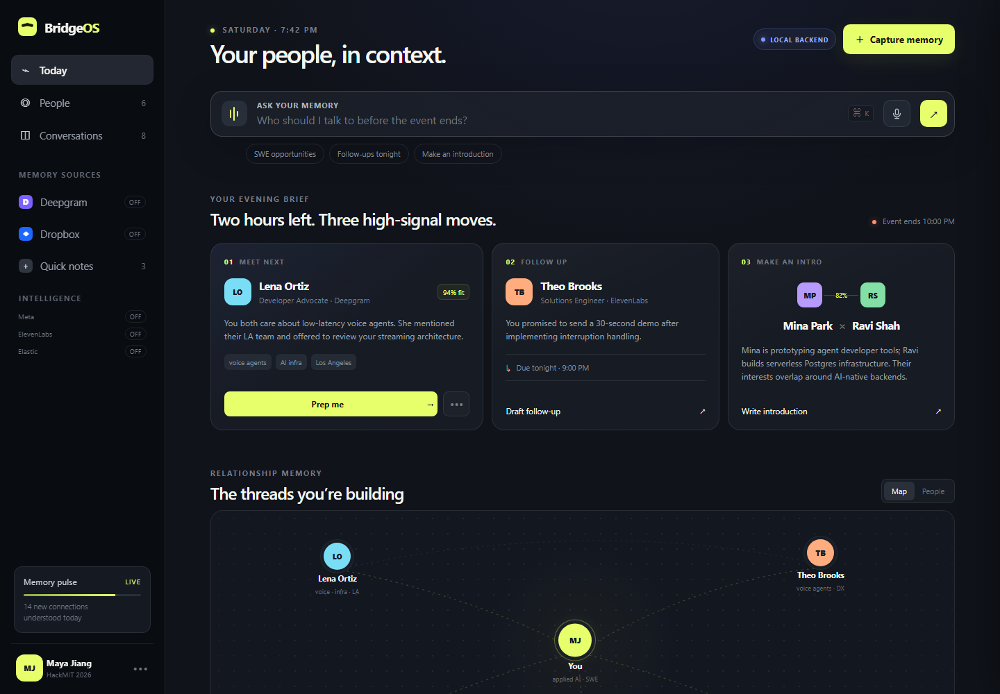
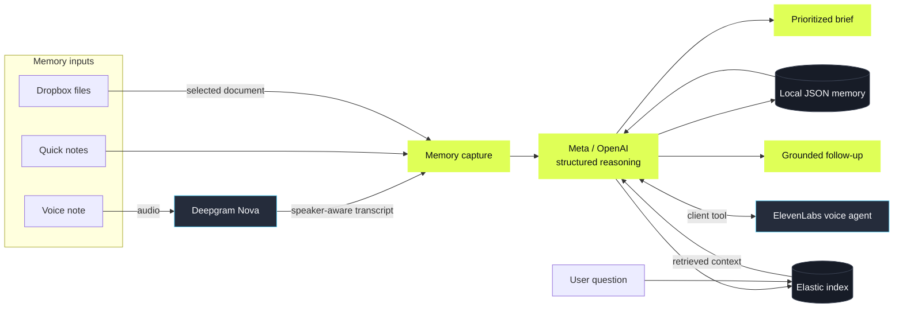

<div align="center">

# BridgeOS

### Your people, in context.

**A relationship-memory copilot that turns scattered conversations into the next right action.**

[](https://hackmit.org/)


</div>


## The idea

At a hackathon, conference, or busy workday, the most valuable context is often the easiest to lose: a promise made in a hallway, a warm introduction, a shared interest, or the person you meant to follow up with.

**BridgeOS remembers the relationship—not just the note.** It transforms transcripts, voice notes, and documents into structured people, topics, commitments, opportunities, and next actions. Then it continuously recalculates who matters now and why.

> Capture a conversation. Understand what changed. Retrieve the right context. Take the next action.



<p align="center"><sub>The working BridgeOS dashboard in local fallback mode. Add credentials to activate each live integration.</sub></p>

## The 2-minute demo

| Beat | What happens | What the audience sees |
|---|---|---|
| **1 · Capture** | Paste a conversation, record a voice note, or import a Dropbox document. | One lightweight input instead of another CRM form. |
| **2 · Understand** | BridgeOS extracts the person, company, topics, promise, opportunity, and next move. | Messy human context becomes structured memory. |
| **3 · Recalculate** | The new memory is persisted, indexed, and compared with the user’s goals and existing relationships. | The evening brief changes immediately. |
| **4 · Act** | Ask why, generate a follow-up, or speak with the memory through a voice agent. | A grounded recommendation becomes an action. |

## How it works



The server uses one stable memory contract whether reasoning is powered by Meta, OpenAI, or the deterministic local fallback. That keeps the end-to-end product demonstrable even when a sponsor service is unavailable.

## Integrations that matter to the product

| Integration | Role in the core workflow | Activation |
|---|---|---|
| **Meta Model API** | Structured memory extraction, grounded answers, and follow-up drafting through the Responses API. | `MODEL_API_KEY` + `AI_PROVIDER=meta` |
| **Deepgram** | Browser recording → Nova transcription and diarization → the same memory-extraction pipeline. | `DEEPGRAM_API_KEY` |
| **Elastic** | Indexes every captured relationship memory and retrieves relevant context before an answer is generated. | `ELASTICSEARCH_URL` + `ELASTIC_API_KEY` |
| **Dropbox** | Lists and imports selected text documents directly into memory capture. | `DROPBOX_ACCESS_TOKEN` |
| **ElevenLabs** | Runs a private conversational agent with live audio, BridgeOS context, and a grounded memory-search tool. | `ELEVENLABS_API_KEY` + `ELEVENLABS_AGENT_ID` |
| **OpenAI** | Optional alternative reasoning provider using the same schemas and server-side key boundary. | `OPENAI_API_KEY` + `AI_PROVIDER=openai` |

Integration status is visible in the UI. Missing credentials never masquerade as a live connection: BridgeOS labels the service **off** and continues in local fallback mode.

## Run locally

Requirements: **Node.js 20 or newer.** There are no package dependencies to install.

```bash
git clone https://github.com/Bingxi-Jiang/BridgeOS.git
cd BridgeOS
cp .env.example .env
node server.mjs
```

On Windows PowerShell, use `Copy-Item .env.example .env` instead of `cp`.

Open **[http://127.0.0.1:4174](http://127.0.0.1:4174)**. The project works immediately in local mode; add only the credentials needed for the integrations you want to demonstrate.

## Configuration

<details>
<summary><strong>Environment variables</strong></summary>

| Variable | Default | Purpose |
|---|---|---|
| `HOST` | `127.0.0.1` | Bind address. |
| `PORT` | `4174` | HTTP port. |
| `AI_PROVIDER` | `auto` | `auto`, `meta`, or `openai`; auto prefers Meta when both keys exist. |
| `MODEL_API_KEY` | empty | Enables Meta Model API. |
| `META_MODEL` | `muse-spark-1.3` | Meta model used for reasoning. |
| `OPENAI_API_KEY` | empty | Enables the OpenAI Responses API path. |
| `OPENAI_MODEL` | `gpt-5-mini` | OpenAI model used for reasoning. |
| `DEEPGRAM_API_KEY` | empty | Enables recorded-audio transcription and diarization. |
| `ELEVENLABS_API_KEY` | empty | Server credential for a private ElevenLabs Agent. |
| `ELEVENLABS_AGENT_ID` | empty | Agent used by the live voice button. |
| `ELASTICSEARCH_URL` | empty | Elasticsearch deployment URL. |
| `ELASTIC_API_KEY` | empty | Enables relationship-memory indexing and retrieval. |
| `ELASTIC_INDEX` | `bridgeos-memory` | Index receiving relationship-memory documents. |
| `DROPBOX_ACCESS_TOKEN` | empty | Enables file listing and text-file download. |
| `DROPBOX_ROOT_PATH` | empty | Optional Dropbox import root. |
| `DATA_FILE` | `./data/memory-store.json` | JSON persistence path. |
| `RESET_STORE_ON_START` | `true` | Restores a clean judge-demo state after each restart. |

API keys stay on the server. `.env` is ignored by Git.

</details>

<details>
<summary><strong>ElevenLabs agent tool setup</strong></summary>

Configure a client tool named `ask_bridge_memory` with one string parameter named `question`. The browser executes the tool through `/api/ask` and returns the grounded result to the agent.

</details>

## API surface

<details>
<summary><strong>Backend routes</strong></summary>

| Method | Route | Purpose |
|---|---|---|
| `GET` | `/api/health` | Backend mode and integration readiness. |
| `GET` | `/api/state` | Persisted memories and derived counts. |
| `POST` | `/api/memories` | Extract and persist relationship memory. |
| `POST` | `/api/ask` | Answer using seeded and captured context. |
| `POST` | `/api/drafts` | Draft a grounded follow-up. |
| `POST` | `/api/deepgram/transcribe` | Transcribe recorded audio with speaker turns. |
| `GET` | `/api/dropbox/files` | List importable Dropbox files. |
| `POST` | `/api/dropbox/import` | Import Dropbox text context. |
| `POST` | `/api/elastic/search` | Inspect relationship-memory retrieval. |
| `GET` | `/api/elevenlabs/signed-url` | Create a private ElevenLabs agent session. |
| `GET` | `/api/integrations` | Inspect sponsor configuration status. |

</details>

## Project map

```text
BridgeOS/
├── dist/                 # Product UI
│   ├── index.html
│   ├── styles.css
│   └── app.js
├── docs/assets/          # README visuals
├── test/                 # Backend and integration contracts
├── integrations.mjs      # Sponsor service adapters
├── server.mjs            # HTTP server, persistence, and reasoning
├── .env.example          # Safe configuration template
└── PROJECT_NOTES.md      # Demo narrative and implementation notes
```

## Verify the build

```bash
node --check integrations.mjs
node --check server.mjs
node --check dist/app.js
node --test
```

The tests cover persistence and the request contracts for Meta Model API, OpenAI, Deepgram, Elastic, Dropbox, and ElevenLabs without requiring production credentials.

---

<div align="center">

### Built at HackMIT 2026

**BridgeOS helps a fleeting conversation become a durable relationship.**

</div>
